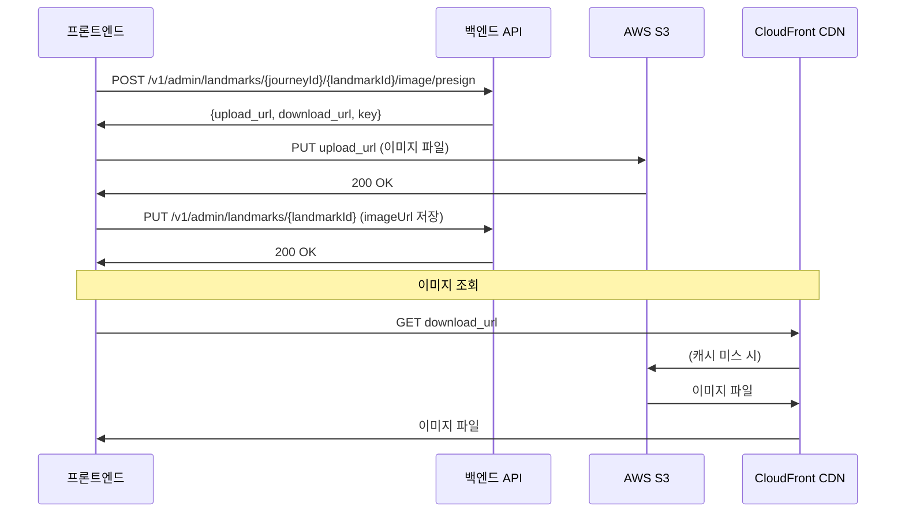

# Admin API 가이드 (프론트엔드용)

## 📋 목차
1. [개요](#개요)
2. [Admin 권한 시스템](#admin-권한-시스템)
3. [이미지 업로드 API 변경사항](#이미지-업로드-api-변경사항)
4. [사용자 권한 확인 API](#사용자-권한-확인-api)
5. [프로필 이미지 캐시 문제 해결](#프로필-이미지-캐시-문제-해결)

---

## 개요

관리자 권한 시스템과 이미지 업로드 경로 구조가 개선되었습니다.

**주요 변경사항:**
- 사용자 역할(Role) 시스템 추가: `USER`, `ADMIN`
- S3 이미지 경로를 계층적 구조로 변경 (여정 > 랜드마크 > 스토리)
- CloudFront 캐시 버스팅 적용
- `/v1/users/me` API에 `role` 필드 추가

---

## Admin 권한 시스템

### 1. 사용자 역할(Role)

**역할 종류:**
- `USER`: 일반 사용자 (기본값)
- `ADMIN`: 관리자

### 2. 권한 확인 방법

**API: GET /v1/users/me**

**Response:**
```json
{
  "success": true,
  "message": "사용자 정보를 성공적으로 조회했습니다.",
  "data": {
    "id": 1,
    "nickname": "홍러너",
    "profile_image_url": "https://cdn.waytoearth.cloud/profiles/1/profile.jpg?v=1734267890",
    "residence": "서울특별시",
    "age_group": "TWENTIES",
    "gender": "MALE",
    "weekly_goal_distance": 20.0,
    "total_distance": 150.5,
    "total_running_count": 25,
    "created_at": "2025-01-15T10:00:00Z",
    "profile_image_key": "profiles/1/profile.jpg",
    "role": "ADMIN"  // ← 권한 확인!
  }
}
```

### 3. 프론트엔드 구현 예시

```javascript
// 로그인 후 권한 확인
async function checkAdminPermission() {
  const response = await fetch('/v1/users/me', {
    headers: {
      'Authorization': `Bearer ${accessToken}`
    }
  });

  const { data } = await response.json();

  if (data.role === 'ADMIN') {
    // Admin 메뉴 표시
    showAdminMenu();
  } else {
    // 일반 사용자 메뉴만 표시
    showUserMenu();
  }
}
```

### 4. Admin API 접근 제어

**Admin API는 `ADMIN` 역할이 있어야만 접근 가능합니다.**

- 경로: `/v1/admin/**`
- 권한 없이 접근 시: `403 Forbidden` 응답

**예시:**
```javascript
// Admin API 호출
const response = await fetch('/v1/admin/landmarks/1/5/image/presign', {
  method: 'POST',
  headers: {
    'Authorization': `Bearer ${accessToken}`,  // ADMIN role 필요
    'Content-Type': 'application/json'
  },
  body: JSON.stringify({
    contentType: 'image/jpeg',
    size: 2048000
  })
});

if (response.status === 403) {
  alert('관리자 권한이 필요합니다.');
}
```

---

## 이미지 업로드 API 변경사항

### 1. 변경된 S3 키 구조

**변경 전:**
```
journeys/landmarks/{날짜}/{userId}/{UUID}
journeys/stories/{날짜}/{userId}/{UUID}
```

**변경 후:**
```
journeys/{journeyId}/landmarks/{landmarkId}/{uuid}.jpg
journeys/{journeyId}/landmarks/{landmarkId}/stories/{storyId}/{uuid}.jpg
```

**장점:**
- 여정별/랜드마크별/스토리별 계층적 그룹 관리
- 여러 이미지 업로드 지원
- S3 폴더 단위 관리 및 삭제 용이

### 2. 랜드마크 이미지 업로드 API

**Endpoint:** `POST /v1/admin/landmarks/{journeyId}/{landmarkId}/image/presign`

**Request:**
```json
{
  "contentType": "image/jpeg",
  "size": 2048000
}
```

**Response:**
```json
{
  "success": true,
  "message": "랜드마크 이미지 업로드 URL이 성공적으로 발급되었습니다.",
  "data": {
    "upload_url": "https://waytoearth-assets-prod.s3.ap-northeast-2.amazonaws.com/journeys/1/landmarks/5/abc123.jpg?...",
    "download_url": "https://cdn.waytoearth.cloud/journeys/1/landmarks/5/abc123.jpg?v=1734267890",
    "key": "journeys/1/landmarks/5/abc123.jpg",
    "expires_in": 300
  }
}
```

**사용 방법:**
```javascript
// 1. Presigned URL 발급
const presignResponse = await fetch('/v1/admin/landmarks/1/5/image/presign', {
  method: 'POST',
  headers: {
    'Authorization': `Bearer ${adminToken}`,
    'Content-Type': 'application/json'
  },
  body: JSON.stringify({
    contentType: file.type,
    size: file.size
  })
});

const { data } = await presignResponse.json();

// 2. S3에 직접 업로드 (PUT 요청)
await fetch(data.upload_url, {
  method: 'PUT',
  headers: {
    'Content-Type': file.type
  },
  body: file
});

// 3. DB에 download_url 저장
await updateLandmark({
  landmarkId: 5,
  imageUrl: data.download_url
});
```

### 3. 스토리 이미지 업로드 API

**Endpoint:** `POST /v1/admin/story-cards/{journeyId}/{landmarkId}/{storyId}/image/presign`

**Request:**
```json
{
  "contentType": "image/jpeg",
  "size": 2048000
}
```

**Response:**
```json
{
  "success": true,
  "message": "스토리 이미지 업로드 URL이 성공적으로 발급되었습니다.",
  "data": {
    "upload_url": "https://waytoearth-assets-prod.s3.ap-northeast-2.amazonaws.com/journeys/1/landmarks/5/stories/10/def456.jpg?...",
    "download_url": "https://cdn.waytoearth.cloud/journeys/1/landmarks/5/stories/10/def456.jpg?v=1734267891",
    "key": "journeys/1/landmarks/5/stories/10/def456.jpg",
    "expires_in": 300
  }
}
```

**사용 방법:**
```javascript
// 스토리 이미지 업로드 (랜드마크와 동일한 흐름)
const presignResponse = await fetch('/v1/admin/story-cards/1/5/10/image/presign', {
  method: 'POST',
  headers: {
    'Authorization': `Bearer ${adminToken}`,
    'Content-Type': 'application/json'
  },
  body: JSON.stringify({
    contentType: file.type,
    size: file.size
  })
});

const { data } = await presignResponse.json();

await fetch(data.upload_url, {
  method: 'PUT',
  headers: {
    'Content-Type': file.type
  },
  body: file
});

await updateStory({
  storyId: 10,
  imageUrl: data.download_url
});
```

### 4. 이미지 업로드 전체 플로우



---

## 사용자 권한 확인 API

### API 상세

**Endpoint:** `GET /v1/users/me`

**Headers:**
```
Authorization: Bearer {accessToken}
```

**Response:**
```json
{
  "success": true,
  "message": "사용자 정보를 성공적으로 조회했습니다.",
  "data": {
    "id": 1,
    "nickname": "홍러너",
    "profile_image_url": "https://cdn.waytoearth.cloud/profiles/1/profile.jpg?v=1734267890",
    "residence": "서울특별시",
    "age_group": "TWENTIES",
    "gender": "MALE",
    "weekly_goal_distance": 20.0,
    "total_distance": 150.5,
    "total_running_count": 25,
    "created_at": "2025-01-15T10:00:00Z",
    "profile_image_key": "profiles/1/profile.jpg",
    "role": "USER"  // "USER" or "ADMIN"
  }
}
```

### React 예시 코드

```typescript
interface UserInfo {
  id: number;
  nickname: string;
  profile_image_url: string;
  residence: string;
  age_group: string;
  gender: string;
  weekly_goal_distance: number;
  total_distance: number;
  total_running_count: number;
  created_at: string;
  profile_image_key: string;
  role: 'USER' | 'ADMIN';  // ← 추가됨
}

// 사용자 정보 조회
async function fetchUserInfo(): Promise<UserInfo> {
  const response = await fetch('/v1/users/me', {
    headers: {
      'Authorization': `Bearer ${getAccessToken()}`
    }
  });

  const { data } = await response.json();
  return data;
}

// Admin 여부 확인
function isAdmin(user: UserInfo): boolean {
  return user.role === 'ADMIN';
}

// 조건부 렌더링 예시
function Navigation({ user }: { user: UserInfo }) {
  return (
    <nav>
      <Link to="/home">홈</Link>
      <Link to="/profile">프로필</Link>
      {isAdmin(user) && (
        <Link to="/admin">관리자 페이지</Link>
      )}
    </nav>
  );
}
```

---

## 프로필 이미지 캐시 문제 해결

### 문제 상황

CloudFront CDN이 이미지를 캐시하기 때문에, 같은 파일명으로 업데이트해도 이전 이미지가 계속 표시되는 문제가 있었습니다.

### 해결 방법

**캐시 버스팅(Cache Busting)** 적용:
- 모든 이미지 URL에 타임스탬프 쿼리 파라미터 추가
- 매번 새로운 URL이 생성되어 캐시를 우회

**변경 전:**
```
https://cdn.waytoearth.cloud/profiles/1/profile.jpg
```

**변경 후:**
```
https://cdn.waytoearth.cloud/profiles/1/profile.jpg?v=1734267890123
```

### 프론트엔드 영향

**자동 적용됨 - 별도 처리 불필요:**
- `/v1/users/me` 호출 시 항상 최신 타임스탬프가 포함된 URL 반환
- 이미지 업로드 후 사용자 정보 다시 조회하면 자동으로 최신 이미지 표시

**권장 사용 패턴:**
```javascript
// 이미지 업로드 후
async function updateProfileImage(file) {
  // 1. Presigned URL 발급
  const presignRes = await fetch('/v1/files/presign/profile', {
    method: 'POST',
    headers: {
      'Authorization': `Bearer ${token}`,
      'Content-Type': 'application/json'
    },
    body: JSON.stringify({
      contentType: file.type,
      size: file.size
    })
  });

  const { data: presign } = await presignRes.json();

  // 2. S3 업로드
  await fetch(presign.upload_url, {
    method: 'PUT',
    headers: { 'Content-Type': file.type },
    body: file
  });

  // 3. 프로필 업데이트
  await fetch('/v1/users/me', {
    method: 'PUT',
    headers: {
      'Authorization': `Bearer ${token}`,
      'Content-Type': 'application/json'
    },
    body: JSON.stringify({
      profileImageKey: presign.key
    })
  });

  // 4. 최신 사용자 정보 조회 (새 타임스탬프 포함된 URL)
  const userRes = await fetch('/v1/users/me', {
    headers: { 'Authorization': `Bearer ${token}` }
  });

  const { data: user } = await userRes.json();

  // 5. UI 업데이트 (자동으로 최신 이미지 표시됨)
  updateUserProfile(user);
}
```

---

## 추가 참고사항

### 1. 파일 크기 제한

| 타입 | 최대 크기 |
|------|----------|
| 프로필 이미지 | 5MB |
| 피드 이미지 | 10MB |
| 랜드마크 이미지 | 10MB |
| 스토리 이미지 | 10MB |

### 2. 지원 파일 형식

- `image/jpeg` (.jpg, .jpeg)
- `image/png` (.png)
- `image/webp` (.webp)

### 3. Presigned URL 만료 시간

- **업로드 URL**: 5분
- **다운로드 URL**: 만료 없음 (CloudFront 사용 시)

### 4. 에러 처리

```javascript
// Admin API 호출 시 권한 체크
async function callAdminAPI() {
  try {
    const response = await fetch('/v1/admin/landmarks/1/5/image/presign', {
      method: 'POST',
      headers: {
        'Authorization': `Bearer ${token}`,
        'Content-Type': 'application/json'
      },
      body: JSON.stringify({ contentType: 'image/jpeg', size: 2048000 })
    });

    if (response.status === 403) {
      alert('관리자 권한이 필요합니다.');
      return;
    }

    if (response.status === 401) {
      alert('로그인이 필요합니다.');
      redirectToLogin();
      return;
    }

    const data = await response.json();
    // 성공 처리

  } catch (error) {
    console.error('Admin API 호출 실패:', error);
  }
}
```

### 5. 개발 환경 테스트

**Mock Header 사용 (개발 환경 전용):**
```javascript
// postman-disabled 프로파일에서만 작동
fetch('/v1/admin/landmarks/1/5/image/presign', {
  method: 'POST',
  headers: {
    'X-Mock-UserId': '1',
    'X-Mock-Role': 'ADMIN',  // Mock Admin 권한
    'Content-Type': 'application/json'
  },
  body: JSON.stringify({ contentType: 'image/jpeg', size: 2048000 })
});
```

---

## 문의

백엔드 API 관련 문의사항이 있으시면 백엔드 팀에게 연락 주세요.
